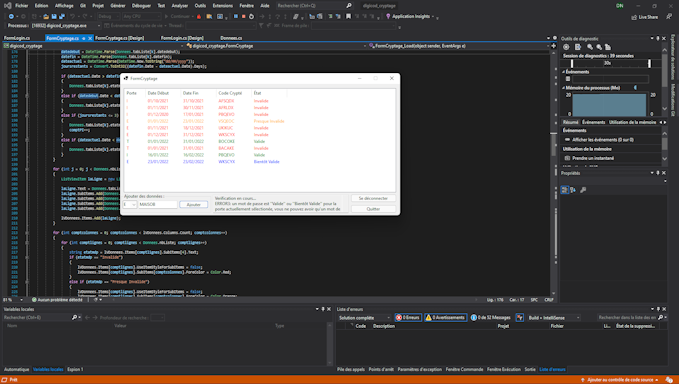
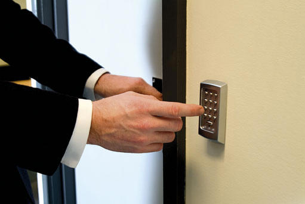

# 
Bienvenue sur le projet DIGICODE !

Ce programme permet à l’administrateur du réseau de générer et de crypter les codes d’entrées des bâtiments, de surveiller les erreurs de saisie des codes d’accès et de diffusion des codes.

## 
Prérequis :

L'application est disponible en éxécuatable et en solution source ce qui permettra à de futurs développeurs de travailler dessus.

Pour pouvoir reprendre le projet, il faudra au préalable installer Visual Studio pour ouvrir le fichier solution (.sln) !

## 
Auteurs :

NOLLE Damien - Chef de projet et développeurs.

DUCHENE Clément et LETELLIER Thomas - Développeurs.

*
Nous sommes tous les trois des étudiant en BTS SIO (SLAM) à l'établissement Saint-Adjutor, à Vernon.
*

M. Lucien SAPIN - Directeur de la Maison des Ligues de Lorraine (M2L).

*
Qui nous a commandé le projet et permis sa réalisation.
*
 
***
TOUT LES DROITS DU PROJET REVIENNENT À LA M2L !
***

## 
Standardisation du nom des éléments :

Tout les éléments du projet se nomme de la manière suivante : **\[initial élément]_\[action]**

***Exemple :*** le bouton pour ajouter se nommera *"btn_ajouter"*, la textBox pour le code sera *"tB_Code"*, etc...

## 
Déploiement :

L'application, une gois générer, doit être mise sur le serveur central ou tout le système des claviers numérique des différents batîments afin de pouvoir déployer les digicodes plus rapidement. Il suffit juste de venir copier-coller le logiciel et de le lancer pour qu'il puisse passé en mode configuration afin de pouvoir connecter les différents claviers.

## 
Fonctionnalités :

- Mode configuration pour venir configurer les claviers des différents batiments.

- Interface de connexion pour accéder à l'enssemble de l'application via le matricule et le code générer précédement (si aucun code n'a été générer le code par défaut est : 0000).

- Cryptage des code générer.

- En cas d'erreur de saisie des codes ou lors de la génération des codes, un système d'historique/logs est mis en place.

- Système de diffusion des mots de passe aux claviers et aux employés.

## 
Tehcnologies :

La M2L dispose de claviers numériques sur les murs de leurs différents batiments qui, en saisissant le bon code, permet d'ouvrir la porte. Les claviers sont liés au serveur principal via des câbles afin de les contrôler sur celui-ci nottament via le logiciel DIGICODE.

## 
Merci !

***Merci beaucoup à la M2L de nous avoir fait confiance tout au long du projet et merci à l'établissement Saint-Adjutor de nous avoir enseigné tout ce qui a permis la réalisation de celui-ci !***
  
**
Version de DIGICODE :** 1.0
